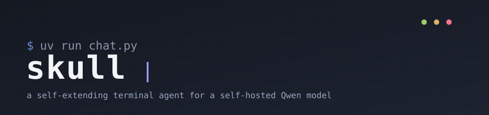

<p align="center">
  
</p>

<p align="center">
  
  
  
  
</p>

<p align="center">
  Tool calling · self-extending skills · skill pipelines (DAGs) · long-term memory<br>
  with automatic fact supersession · document &amp; OCR reading · plan/auto execution modes
</p>

<p align="center"><sub>147 tests · zero external tokenizer dependency · every non-trivial feature below shipped with a real bug found by testing it against the live model, not reasoned out on paper</sub></p>

---

<p align="center">
  
</p>

<p align="center"><sub>Unedited recording — the model calling a self-created skill, then recalling real stored memory, in a real terminal.</sub></p>

## Why this exists

Most "agent" demos wire up a model, a couple of tools, and call it done.
This one is built around a harder question: what actually breaks when you
run it for real, for weeks, with a model that has a 32K context window, no
vision, and a habit of doing exactly what you told it to do — including
the parts you didn't mean literally?

> [!NOTE]
> Every bullet below is a bug that actually happened, was reproduced, and
> is now fixed — not a hypothetical.

- A single oversized tool result can blow the context window in one shot,
  even with automatic compaction already running. It happened when the
  model tried moving a generated file out of its sandbox by base64-encoding
  it through the conversation.
- Embedding similarity alone can't tell "the user changed their mind" from
  "the user mentioned something related." Verified with real examples: a
  genuine contradiction and a harmless unrelated fact landed on
  *overlapping* ranges of cosine similarity. A model has to make that call,
  not a vector distance.
- A model that accepts an `image_url` payload without erroring, and has no
  way to actually see it, will confidently describe the wrong color of a
  test image rather than refuse. Checked directly against this endpoint,
  not assumed from the model's name.
- A terminal that looks fine will still corrupt itself after enough raw
  mode toggling, or eat half a pasted paragraph — in ways that only show
  up after real use, not synthetic tests.

### Why you might *not* want this

- It's built around one specific self-hosted Qwen endpoint's behavior and
  quirks (context limit, no vision, tool-call format) — porting to a very
  different provider means re-verifying those assumptions, not just
  swapping a base URL.
- Every mutating tool other than skill creation is intentionally slow to
  use safely: shell commands and file writes require an interactive y/n
  every single time, by design. If you want a fully autonomous, no-prompts
  agent, that's a different tradeoff than this project makes.
- The self-extending skill system means the model can and will write and
  save Python that runs later with no review step beyond an import
  sanity-check. That's the point, but it's not for everyone's risk
  tolerance.

## Table of contents

- [What it can do](#what-it-can-do)
- [Architecture](#architecture)
- [Requirements](#requirements)
- [Setup](#setup)
- [Run](#run)
- [In-session commands](#in-session-commands)
- [Testing](#testing)
- [Environment variables](#environment-variables)
- [License](#license)

## What it can do

### Chat and tool calling
- Streaming responses in your terminal, full tool-calling loop against an
  OpenAI-compatible `/v1/chat/completions` endpoint
- Inline "ghost text" suggestions for your next likely question (a
  background prediction call, never blocking), arrow-key input history,
  per-action loading animations
- Bracketed-paste-aware raw terminal input — a multi-line paste is joined
  into one message instead of being split into several, and output
  survives a VS Code integrated-terminal quirk that otherwise causes
  progressive text drift after raw-mode is toggled

### Read anything, safely
- `read_file` / `list_directory` — read anywhere on your machine, no
  approval needed (read-only, same trust level as web search)
- **PDF, DOCX, XLSX/XLSM, and PPTX are automatically extracted to
  readable text** — the model gets actual content, not a wall of binary
  noise
- **Images are OCR'd for visible text** (screenshots, scanned pages,
  signs)

  > [!IMPORTANT]
  > This is text recognition, not vision. The chat endpoint accepts an
  > `image_url` block without erroring, but has no way to actually see
  > pixels — confirmed by feeding it solid-color test images and watching
  > it guess the wrong color, twice. OCR pulls text out of a screenshot;
  > it can't describe a photo.

- Every read has a hard size ceiling regardless of what the model asks
  for, so no single file read can approach the context window on its own
- `write_file` and `run_command` require your explicit y/n approval every
  time, since those touch your real filesystem with your real permissions

### Sandbox execution, isolated from your machine
- `run_python` runs throwaway code in an isolated E2B cloud sandbox — no
  access to your local files, network state, or credentials — with state
  persisting across calls within a session
- `sandbox_read_file` / `sandbox_write_file` / `sandbox_list_directory`
  for files inside the sandbox, with the same document/OCR extraction as
  local reads
- `download_from_sandbox` pulls a generated binary (a `.docx`, image,
  zip) straight onto your machine as raw bytes via a signed URL —
  approval gated, and specifically built so a binary file never needs to
  be base64-encoded through the conversation, which once single-handedly
  blew the context window in one tool call

### Background processes
- `run_command(background=true)` starts a long-running process (a dev
  server, a file watcher) detached and returns immediately instead of
  hanging until timeout
- `list_background_commands` / `read_background_log` /
  `stop_background_command` to manage it afterward — stopping one kills
  the whole process group, not just the shell wrapper around it

### Self-extension: it writes its own tools
- `create_skill` / `delete_skill` — when no existing tool solves a task,
  the model writes a new Python function (`run(**kwargs)`), it's saved to
  `skills/<name>/`, and it's immediately callable — this session and
  every future one
- Skills can call each other (`call_skill`) instead of duplicating logic,
  raising a proper exception on failure rather than a silent error dict
- **Skill schemas are relevance-filtered per turn** once you've built
  more than a handful — only the ones actually relevant to what you're
  asking get sent to the model, ranked by embedding similarity, so token
  cost stays roughly flat instead of growing forever as you build more
  skills

<details>
<summary>What a self-created skill actually looks like</summary>

A skill is a plain Python file with a `run(**kwargs)` function and a
short markdown description, both written by the model at runtime:

```python
# skills/celsius_to_fahrenheit/run.py
def run(**kwargs):
    celsius = kwargs["celsius"]
    return {"celsius": celsius, "fahrenheit": celsius * 9 / 5 + 32}
```

Once created it's registered in `skills/index.json` and shows up as a
normal callable tool on every future turn — no restart, no re-deploy.

</details>

### Skill pipelines — DAGs, not just chains
- `create_pipeline` / `run_pipeline` / `list_pipelines` /
  `delete_pipeline` — chain existing skills into a saved directed graph,
  with real fan-out (one output feeding several next steps) and fan-in
  (one step needing several previous outputs), not just a linear sequence
- Fully validated at creation time — cycles, unbound parameters, unknown
  field references are all caught before the pipeline is ever saved, with
  the specific problem named, not discovered mid-run
- If any node fails, the whole run stops immediately and reports exactly
  which node and why, with a full per-node execution trace either way

### Long-term memory that actually stays current
- `remember` / `forget` / `recall_memory` — persona facts and
  conversation history persist across sessions using local embeddings (no
  external embeddings API, fully offline after the one-time model
  download)
- **When a new fact contradicts or updates an old one, the old one is
  automatically superseded** — not deleted, just excluded from future
  recall, with the full history still auditable

  > [!TIP]
  > This needed two stages, not one: a cheap embedding pre-filter to find
  > candidate topics, then one actual LLM call to confirm real
  > contradiction — because testing showed real contradicting fact pairs
  > and merely-related fact pairs land on overlapping similarity ranges.
  > No single threshold is safe alone.

- `forget` falls back to a confirmed fuzzy match when the model
  paraphrases instead of quoting a fact exactly, instead of silently
  doing nothing while the model narrates false success
- Backed by SQLite + `sqlite-vec`, not a hand-rolled flat file — real
  per-row deletes, crash-safe transactions, one file per store instead of
  a jsonl/vector-file pair that can silently drift out of sync

### Context management that doesn't just fail
- Automatic compaction summarizes the oldest chunk of conversation into a
  compact note once the estimated size crosses a safety threshold,
  instead of the session erroring out or requiring a manual reset
- Checked on every tool round-trip within a turn, not just once at the
  start — a single turn can accumulate enough tool calls to cross the
  threshold entirely on its own
- Never splits an assistant's tool-call message from its tool response
  when choosing where to cut, which would otherwise produce a
  structurally invalid conversation

### Plan mode
- `/plan` — research-only mode: the model can search, scrape, and read,
  but every mutating tool (writes, shell commands, skill creation, memory
  writes, sandbox writes, pipeline execution) is withheld from its tool
  list entirely, not just discouraged in the prompt
- Self-created skills are excluded wholesale in plan mode too — their
  side effects aren't tracked, so the safe default treats all of them as
  potentially mutating
- `/auto` returns to full tool access

## Architecture

```
chat.py                        thin entry point (uv run chat.py)
src/skull/
    config.py                   env vars, project paths, terminal colors
    core/
        client.py                streaming chat-completion calls to the Qwen endpoint
        session.py                turn-handling loop + interactive REPL
        memory_context.py         memory retrieval, plan-mode instruction addendum
        memory_supersede.py       two-stage (embedding + LLM) fact contradiction/paraphrase detection
        compaction.py             summarizes old history to stay within the context window
    tools/
        registry.py               tool schemas + dispatch, plan-mode filtering, skill relevance ranking
        web.py                    web_search / scrape_page
        sandbox.py                E2B sandbox execution for run_python + sandbox file I/O + download_from_sandbox
        skills.py                 self-created skill storage (skills/<name>/)
        skill_composition.py      call_skill() - lets a skill call another skill
        pipeline.py               skill DAGs: validation, topological execution (pipelines/<name>/)
        shell.py                  run_command (gated) + background process management
        files.py                  local read_file/write_file/list_directory
        document.py               PDF/DOCX/XLSX/PPTX extraction + image OCR, shared by files.py and sandbox.py
        permission.py             shared interactive y/n approval prompt
    storage/
        store.py                  local vector store (persona facts + conversation history), SQLite + sqlite-vec
    ui/
        spinner.py                per-action loading animations
        ghost_input.py             raw-terminal input with ghost text + history + bracketed paste
        suggestion.py              background "next question" prediction
        output.py                  terminal-safe print (explicit \r\n, avoids OPOST quirks)
SYSTEM_PROMPT.md               the model's system prompt (editable without touching code)
skills/                         self-created skills (starts empty, gitignored)
pipelines/                      self-created skill pipelines/DAGs (starts empty, gitignored)
memory/                         persona facts + conversation log (starts empty, gitignored)
tests/                          147 tests, all network calls mocked, all storage isolated to tmp_path
```

`skills/`, `pipelines/`, and `memory/` live at the project root (not
inside `src/skull/`) since they're per-user runtime state, not part of
the installed package — all three are gitignored, and accumulate as you
use the app rather than something you'd commit or ship.

## Requirements

| | |
|---|---|
| **OS** | macOS or Linux — raw-terminal input is POSIX-only; Windows falls back to plain input (no ghost text/history) but should still run |
| **Python** | 3.12+ — `sqlite-vec` needs SQLite's extension-loading support, which some pyenv/system-built Python 3.10 installs lack |
| **Package manager** | [uv](https://docs.astral.sh/uv/) (`curl -LsSf https://astral.sh/uv/install.sh \| sh`) — `uv sync` fetches a matching Python automatically if you don't have one |
| **API** | A Qwen-compatible chat-completions endpoint and key |
| **E2B key** (optional) | Enables `run_python` and the sandbox file tools — everything else works without it |
| **`tesseract`** (optional) | Enables OCR on image files (`brew install tesseract` / `apt install tesseract-ocr`) — without it, reading an image returns a clear error, never a silent failure |

## Setup

```bash
git clone https://github.com/Kroy665/skull.git
cd skull
cp .env.example .env
# edit .env and fill in QWEN_KEY (required), E2B_API_KEY (optional)
uv sync
```

`uv sync` creates a `.venv` and installs every dependency, including a
matching Python interpreter if needed — no manual pip install.

## Run

```bash
uv run chat.py
```

On first run, a local sentence-embedding model (~90MB) downloads once for
the memory feature.

## In-session commands

| Command       | Effect                                                 |
|---------------|-----------------------------------------------------------|
| `/plan`       | Enter plan mode — research only, no writes/actions       |
| `/auto`       | Return to normal mode                                    |
| `/verbose`    | Show full tool call output                               |
| `/concise`    | Collapse tool output to a one-line summary (default)     |
| `/reset`      | Clear conversation history (keeps mode/skills/memory)    |
| `exit`/`quit` | Leave                                                    |

Arrow keys: Up/Down recall previous inputs, Left/Right move the cursor.
Tab or Right-arrow (on an empty line) accepts an inline suggestion.

## Testing

```bash
uv run pytest
```

147 tests across 10 files, covering context compaction, skill/pipeline
CRUD and execution (all validation error paths, fan-out/fan-in, mid-run
failure handling), the vector store (search ranking, delete integrity,
schema migration), memory supersession and fuzzy-forget (including the
exact false-positive case that would make a naive similarity threshold
unsafe), plan-mode tool filtering, and document/OCR extraction. Every
network call is mocked and every filesystem/database operation is
isolated to a temp directory — nothing in the suite touches your real
`skills/`, `pipelines/`, or `memory/`.

> [!NOTE]
> There's no CI workflow wired up yet, so the badge above is a static
> count from the last full run (`uv run pytest`), not a live status
> check — verify it yourself with the command above rather than trusting
> the badge blindly.

## Environment variables

| Variable      | Required | Default                            | Purpose                                    |
|---------------|----------|-------------------------------------|---------------------------------------------|
| `QWEN_KEY`    | Yes      | —                                    | Bearer token for your chat-completions endpoint |
| `QWEN_URL`    | No       | `https://qwen.your-endpoint.example`     | API base URL                                 |
| `QWEN_MODEL`  | No       | `qwen3.8-27b`                        | Model name                                   |
| `E2B_API_KEY` | No       | —                                    | Enables `run_python` and sandbox file tools  |

## License

[GPL-3.0](LICENSE) — you're free to use, modify, and redistribute this,
but a distributed modified version must stay open source under the same
license.
